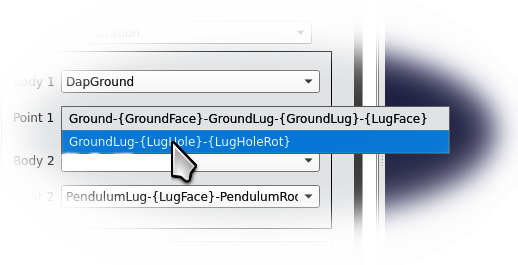

# Nikra-DAP: A Multibody Planar Dynamics Workbench for FreeCAD
# Version 2.0-alpha

The FreeCAD Nikra-DAP WorkBench is a planar multibody dynamics workbench that is based on the DAP solver algorithm developed by P.E.&nbsp;Nikravesh  
(PLANAR MULTIBODY DYNAMICS: Formulation, Programming with MATLAB, and Applications, 2nd Edition, P.E.&nbsp;Nikravesh, CRC Press, 2018)

## Installation

1.  Access the github site for this workbench:   
https://github.com/NikraDAP/FreeCAD-NikraDAP  
2.  Press the green "Code" button   
  
3.  Request the "Download ZIP" option   
  
4. The file "FreeCAD-NikraDAP-main.zip" will be downloaded into your download directory     
5. Move to your download directory     
6. Unzip the "FreeCAD-NikraDAP-main.zip" file into this directory       
7. A directory called "FreeCAD-NikraDAP-main" will be created, containing NikraDAP     
8. Rename the "FreeCAD-NikraDAP-main" directory to the name "FreeCAD-NikraDAP"  
9. Move the "FreeCAD-NikraDAP" directory to your FreeCAD modules directory   
   [ on Linux machines, this is often located at ~/.local/share/FreeCAD/Mod/ ]     
10. Run FreeCAD, and if you have moved Nikra-DAP to the correct directory in (8) above, the Nikra-DAP workbench will appear in your list of workbenches.     
11. If this has not already been done, install the Assembly 4 workbench on your system, using FreeCAD's Addon manager. [This is located underneath the "Tools" option in the menu bar at the top of the FreeCAD window]     
12. If you wish, you can also at this stage, fetch some of the Nikra-DAP tutorial videos at   
https://github.com/NikraDAP/NikraDAP-Videos     

# NikraDAP - Hello World Application
It is customary to call the most simple action which can be performed in a new software package as a "Hello World" application.  [i.e. when writing a program in "C", the simplest program to write, is usually one which simply prints out "Hello World" - hence the name.]

The steps are listed below, to perform a simple Nikra-DAP "Hello World" analysis.  

1. Make sure you have installed both "Nikra-DAP" and "Assembly 4" and that they are listed in your FreeCAD workbench list, and select NikraDAP 
  
2. Load the NikraDAPBeginnersTutorial2.FCStd demo Assembly 4 model into FreeCAD. It will be located in your FreeCAD-NikraDAP folder, typically at
~/.local/share/FreeCAD/Mod/FreeCAD-NikraDAP/NikraDAP-Demo-Models/NikraDAPBeginnersTutorial2.FCStd  
3. If you are not familiar with Assembly 4, then you might wish to first watch the "NikraDAPBeginnersTutorial1" and "NikraDAPBeginnersTutorial2" tutorials, which cover a very simple route to achieve this "Assembly 4" assembly.     
4.  Note that the assembly consists of various FreeCAD objects under the heading "Parts".  Using Assembly 4, one or more Local Coordinate Systems (LCSs) have been added to each object. (You can see the names of the LCSs by expanding the Parts tree as shown below.  The LCS icon, looks like a "Y" leaning over.   
  
5.  Note that under the heading "Model", there are items (actually a link to an object under "Parts") for each of the shapes that make up the Assembly 4 assembly.  By hovering with your cursor over a name, the 3D object in question lights up in yellow.   
  
6.  We now create a new container, which will hold all our NikraDAP information.  Click on the NikraDAP icon at the top, to create this new container, and a "DAPContainer" entry appears at the bottom of the tree .   
  
7.  The first things we put in the container are the bodies of which the assembly is made.  A NikraDAP body, is a group of one or more 3D solids, which stay "stuck" to each other, throughout the analysis.  So in the case of this simple pendulum, the top two objects form the one body, and the bottom three objects, the second body. We now click the add body icon, to start defining the first NikraDAP body. 
  
8. To build up the first body, we click in the selection box named "Part Name" 
  
9. A list of the all the various parts which are available, is shown.  We select "Ground", and click the green "Add" button.  We can then select "GroundLug", and add it as well. 
  
10.  Due to the fact that this NikraDAP body will be stationary, we need to uncheck the "Moving Body" tick box, and then accept our first body, by clicking "OK" 
  
11.  Note than one (and only one) non-moving body must be defined for the analysis to be successful. 
12. Repeat the body definition process (7) (8) and (9) for the "PendulumLug", "PendulumRod" and "PendulumWeight".  (Due to the fact that the pendulum will move, we leave the "Moving Body" checkbox ticked.) Press "OK" 
13. We now have two NikraDAP bodies defined.  If we expand the DapContainer (click on the small arrow-head just to the left of its name), we can see that NikraDAP has named these two bodies DapBody and DapBody001.  We can optionally rename them to a more descriptive name, by clicking on the name, and pressing F2.  Even though it is optional, renaming our objects with descriptive names can aviod much confusion in the long run.  Now rename our two bodies to "DapGround" and "DapPendulum" respectively. 
  
14. We now wish to inform NikraDAP how our bodies are connected.  We must thus define the type and position of the joint connecting them.  We select the "Create a new Joint" icon. 
  
15. The "New Joint" dialog, consists of various selection boxes, which allow us to define exactly where the joint is located.  We first define that this is a Rotation (or Revolute) joint by selecting it in the "Joint Type" selection box.  
  
16. The joint is located on the one NikraDAP body "DapGround", and specifically at the hole in this body. So we wish to select the DapGround as body number 1. 
  
17. When we click on the "Point 1" selection box, the points at the origins of all the LCSs which are defined in our "DapGround" NikraDAP body, are listed for us to select from.  The names which appear in the list, are the names given to the LCSs when they were attached to the respective bodies in Assembly 4.  Even though each LCS consists of an origin, and a set of axes, located in a specific orientation in space, in this situation we are only interested in specifying a point (at which the joint is located).  Thus if there are more than one LCS that have the same point as their origin, (even though their orientation might be different), then they are listed on the same line in the selection list. 
18. In the selection list, items in {} are the names Assembly 4 gave to the LCSs, and the names in front of the {} are the names Assembly 4 gave to the objects.   Thus, the first line which reads: "Ground-{GroundFace}-GroundLug-{GroundLug}-{LugFace}" means that we have an assembly 4 object called "Ground" with an LCS "{GroundFace}", and an object called "GroundLug" with two LCSs "{GroundLug}" and "{LugFace}" attached to it.  All three refer to the same point. 
20.  Even though this sounds terribly confusing, the simple approach is to look at the two options, and look for an LCS name you recognise as being located at the point you wish to define. Then select that option. In this case GroundLug-{LugHole} sounds like it is located where we want to point. 
  

  

In order to utilise the Nikra-DAP solver to solve planar dynamic problems. Several analysis parameters need to be defined. 

These parameters are defined as follows: 

* DapBody: A single body that forms part of a multibody system. The equations of motion are then constructed for this body by using the body-coordinate method. (Nikravesh, 2019) These can be defined as either ground or moving and initial conditions can be assigned to them.

* DapJoint: This defines the Degrees of Freedom between several bodies or between a body and ground. This can either be revolute or linear translation. 

* DapForce:  Forces such as gravity, a linear spring, linear damper, rotational (torsional) spring and rotational damper are options and its placement in the mechanism can also be selected. **(This makes use of the LCS assigned to a body as well as the body itself)** 

* DapMaterial: This defines the material properties for each DapBody. You can also manually insert a density if your material is not shown in the list. 

* DapSolver: Allows you to select the plane of motion and also the time step. The plane of motion can be one of the cartesian planes, a plane auto-generated from a selected object. From an Assembly 4 standpoint, by using the object selection feature, you can select the master sketch and use the plane of motion defined within the master sketch. 

* DapAnimate: Once the solver has completed, you can then view an animation of the DAP Mechanism. 

   

## Our Sponsors:

The initial stages of this project have been funded through Engineering X, an international collaboration founded by the Royal Academy of Engineering and Lloyd's Register Foundation.

It is also part of the "Engineering X: Engineering Skills Where They are Most Needed" mission, which seeks to:   
- support the delivery of skills and education programmes that will lead to the    
- development of much needed engineering skills capacity,   
- enhanced safety standards, and infrastructure which will   
- remain safe and fit for purpose.

