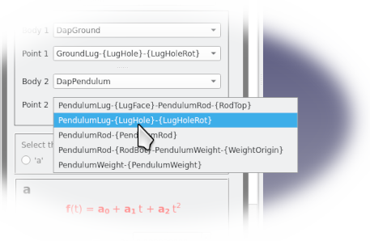

# NikraDAP: A Multibody Planar Dynamics Workbench for FreeCAD
# Version 2.0-alpha

The FreeCAD NikraDAP WorkBench is a planar multibody dynamics workbench that is based on the DAP solver algorithm developed by P.E.&nbsp;Nikravesh (**PLANAR MULTIBODY DYNAMICS: Formulation, Programming with MATLAB, and Applications**, 2nd Edition, *P.E.&nbsp;Nikravesh*, CRC&nbsp;Press, 2018) 
  
## Sister Web Site
FreeCAD-NikraDAP has a sister website: https://github.com/NikraDAP/NikraDAP-Videos 
on which you can find, and from which you can download, various tutorial videos  
## Installation
### Automatic Installation (Recommended)
1.  You should be connected to the internet. 
2.  Select **Tools** from the FreeCAD menu line at the top of the page. 
3.  Select **Addon Manager** at the bottom of the drop-down menu which appears. 
4.  Select **NikraDAP** from the list of available Addons.  (They are arranged alphabetically.) 
5.  The **NikraDAP** README appears - click on **Install** 
6.  Sit back and relax.  [Thanks goes to @luzpaz for helping us to install this] 

   
<h3>Manual Installation</h3>

   
If for some or other reason, you are struggling with adding NikraDAP using the AddOn Manager, you can use this, much more tedious, approach: 
1.  Access the github site for this workbench [if you are reading this, you are possibly there already]: https://github.com/NikraDAP/FreeCAD-NikraDAP  
2.  Press the green **Code** button 
 
3.  Request the **Download ZIP** option   
 
4. The file **FreeCAD-NikraDAP-main.zip** will be downloaded into your download directory 
5. Move to your download directory 
6. Unzip the **FreeCAD-NikraDAP-main.zip** file into this directory 
7. A directory called **FreeCAD-NikraDAP-main** will be created, containing NikraDAP 
8. Rename the **FreeCAD-NikraDAP-main** directory to the name **FreeCAD-NikraDAP** 
9. Move the **FreeCAD-NikraDAP** directory to your FreeCAD modules directory
[ on Linux machines, this directory is  often at **~/.local/share/FreeCAD/Mod/** , on Windows machines, it is typicalled stored at **C:\\Users\\*username*\\AppData\\Local\\Programs\\FreeCAD X\\Mod\\** or  **C:\\Program Files\\FreeCAD X\\Mod\\** where X is your current version ] 
10. Run FreeCAD, and if you have moved NikraDAP to the correct directory in the above step, the NikraDAP workbench will appear in your list of workbenches. 
11. If this has not already been done, install the *Assembly4* workbench on your system, using FreeCAD's Addon manager. [This is located underneath the **Tools** option in the menu bar at the top of the FreeCAD window] *(Assembly4 is a powerful FreeCAD workbench written by **Zoltan Hubert**)* 
12. If you wish, you can also at this stage, fetch some of the NikraDAP tutorial videos at 
https://github.com/NikraDAP/NikraDAP-Videos  

# Basic Structure of NikraDAP

In order solve planar dynamic problems, a few basic units must be defined.  In brief, these are: 
* **DapBody:** Defines a single body which consists of an assembled group of one or more 3D solids, and that in turn, forms part of a multibody system. 
* **DapJoint:** Defines the Degrees of Freedom which exist amongst several bodies or between bodies and ground. 
* **DapForce:**  Defines the forces acting on and between bodies, such as gravity, springs and dampers. 
* **DapMaterial:** Defines the density (i.e. mass) of all the constituent parts of a DapBody, which is defined by selecting a material type from a list, or by inserting a custom density. 
* **DapSolver:** Defines the length of time for NikraDAP to solve over, the time step, and the location of a spreadsheet output file. 
* **DapAnimate**: Once the system has been solved, allows the viewing of an animation of the entire NikraDAP Mechanism.  

   
<h1>NikraDAP - Hello World Application</h1>

   
It is customary to call the most simple application which can be performed when approaching a new software package for the first time, a **Hello World** application.  [*eg.* when writing a program in **C**, the simplest program to write, is usually one which simply prints out **Hello World** - hence the name.]  
Steps are listed below, to perform a simple NikraDAP **Hello World** analysis. Some steps might seem trivial, but should the user persist through each step, one at a time, he or she will be able to perform a full NikraDAP analysis on a simple mechanism, after which, much further learning is possible by experimenting with alternative bodies, settings or buttons. 

1. Make sure you have installed both **NikraDAP** and **Assembly4** and that they are listed in your FreeCAD workbench list. *(Assembly4 is a powerful FreeCAD workbench written by **Zoltan Hubert**, which is available using the FreeCAD **Addon manager**)*.  Now select NikraDAP. 
 
2. Load the NikraDAPBeginnersTutorial2.FCStd *Assembly4* model into FreeCAD. It will be located in your FreeCAD-NikraDAP folder, typically at 
**~/.local/share/FreeCAD/Mod/FreeCAD-NikraDAP/NikraDAP-Demo-Models/NikraDAPBeginnersTutorial2.FCStd** 
or for Windows, at  **C:\\Program Files\\FreeCAD X\\Mod\\FreeCAD-NikraDAP\\NikraDAP-Demo-Models\\NikraDAPBeginnersTutorial2.FCStd**   
3. If you are not familiar with *Assembly4*, then you might wish to first watch the **NikraDAPBeginnersTutorial1** and **NikraDAPBeginnersTutorial2** tutorials, which cover a very simple route to achieve this *Assembly4* assembly.  
4.  Note that the assembly contains various FreeCAD objects under the heading **Parts**.  Using *Assembly4*, one or more Local Coordinate Systems (LCSs) have been added to each object. The names of the LCSs (Local Coordinate Systems) can be seen by expanding the **Parts** tree as shown below.  The LCS icon is the image of a small coordinate system, but looks like a **Y** leaning over to the right. (From now on, we will refer to a **Local Coordinate System** simply as an **LCS**). 
  
5.  Furthermore, note that under the heading **Model**, there are items (actually links to objects under **Parts**) for each of the shapes that make up the *Assembly4* assembly.  To help you identify the names and ojects, if you hover with your cursor over a name, the 3D object in question lights up in yellow. 
  
6.  We now create a new container, which will hold all our NikraDAP information.  Click on the NikraDAP icon at the top, to create this new container, and a **DAPContainer** entry appears at the bottom of the tree    
  
7.  The first things we put in the container are the bodies which make up the assembly.  A NikraDAP body, is a group of one or more 3D solids, which stay rigidly attached to each other, throughout the analysis.  So in the case of this simple pendulum, the top two objects form the one NikraDAP body (the ground), and the bottom three objects, the second NikraDAP body (the pendulum). Click the **add body** icon, to start defining the first NikraDAP body. 
  
8. To build up the first NikraDAP body, we click in the selection box named **Part Name** 
  
9. A list of the all the various parts which are available, is shown.  We select **Ground**, and click the green **Add** button.  We can then select **GroundLug**, and add it as well. 
  
10.  Due to the fact that this NikraDAP body will be stationary, we need to uncheck the **Moving Body** tick box, and then accept our first body, by clicking **OK** 
  
11.  Note that one (and only one) non-moving body must be defined for the analysis to be successful.  If more than one object exists, which in your NikraDAP system, get attached to ground, then they must all be added to this one, non-moving body.  (It does not matter, should this non-moving **ground** body be made up of objects which are not physically attached to each other.)  
12. Repeat the body definition steps above to add the three parts **PendulumLug**, **PendulumRod** and **PendulumWeight** to form another body. (All three must be added to the one new NikraDAP body in step (9) ).  
13. Due to the fact that the pendulum will move, we leave the **Moving Body** checkbox ticked. Press **OK**  
14. We now have two NikraDAP bodies defined.  If we expand the DapContainer (click on the small arrow-head just to the left of its name), we can see that NikraDAP has named these two bodies DapBody and DapBody001.  We can optionally rename them to a more descriptive name, by clicking on the name, and pressing **F2**.  Even though it is optional, renaming our objects with descriptive names can aviod much confusion in the long run.  Now rename our two bodies to **DapGround** and **DapPendulum** respectively. 
  
15. We now wish to inform NikraDAP how our bodies are connected.  We must thus define the type and position of the joint connecting them.  We select the **Add a new Joint** icon. 
  
16. The **Joint Definition** dialog box, consists of various selection boxes, which allow us to define exactly where the joint is located.  We first define that this is a Rotation (or Revolute) joint by selecting it in the **Joint Type** selection box.  
  
17. The joint is located on the one NikraDAP body **DapGround**, and specifically at the hole in this body. So we wish to select the DapGround as body number 1.  We click the Body 1 selection box.  The names of all the NikraDAP bodies appear (in our case, the two names **DapGround** and **DapPendulum**). We select **DapGround** 
  
18. We now want to define the point in the **DapGround** body, where the rotation joint is located. When we click on the **Point 1** selection box, the points at the origins of all the LCSs which are defined in our **DapGround** NikraDAP body, are listed for us to select from. 
  
19. The naming of these points follows a few simple rules:
>**All the items on a single line refer to a single point**. Even though each LCS consists of both an origin, and a set of axes located in a specific orientation in space, in this situation we are only interested in specifying a **point** (at which the joint is located).  Thus if there are more than one LCS that have the same **point as their origin**, (even though their orientation might be different), they are listed on the same line in this selection list.  
>**Names between braces ( '{' and '}' ) refer to LCS names** These are the names given to the LCSs when they were attached to the respective bodies in *Assembly4*.  If you look at the parts which appear below the **Parts** heading in the FreeCAD tree, you will see an item for each of the LCSs attached to each part, with its name, and its icon (the slanted **Y** we referred to earlier).  This name is the name which here appears between **{** and **}**.  
>**Names which are not between braces, are the Assembly4 part name**. These are the names which appear, under the *Assembly4* **Model** heading in the FreeCAD tree.  
>Thus each **line** consists of: **Assembly4 part name** followed by one or more **\{*LCSname*\}-\{*LCSname*\}-\{*LCSname*\}** for each LCS attached to this *Assembly4* part.  Then, if there are more LCSs attached to another *Assembly4* part, which also refer to the same point, the line will continue with **Assembly4 part name-\{*LCSname*\}-\{*LCSname*\}-\{*LCSname*\}** etc. 

20.  Even though this sounds terribly confusing, the simplest approach is to look at all the options, and look for any LCS name you recognise as being located at the point you wish to define. Then select that option. In this case **GroundLug-{LugHole}** sounds like it is located at the hole of the **GroundLug**, which is where we want the joint to be located.  So we select **GroundLug-{LugHole}-{LugHoleRot}** as Point 1.  
21. We have now finished defining the half of the joint which resides on the **DapGround** body.  We now wish to define the point of the joint which resides on the pendulum.  We follow the exact same procedure to define Body 2 and Point 2.  In this case they are **DapPendulum** and **PendulumLug-{LugHole}-{LugHoleRot}** respectively 
  
22. Once you have accepted your joint definition, by pressing **OK**, you will see confirmation of the point you have selected in the form of a circular arrow around the Joint.  As further confirmation of your selection, if this arrow is broken or not visible at all, you have most probably defined one or both of the joint points incorrectly. 
  
23. We will now define the mass of each of the component parts which make up our bodies.  Due to the fact that FreeCAD already knows the volume of our parts, we only need to define the density.  Select the **Materials** icon to start the definition process. 
    
24. In the Materials dialog that pops up, a list is shown of all the *Assembly4* parts.  For each part, a material density can be defined.  The units in which the density is entered and displayed can be selected between kg/m^3 and g/cm^3. 
  
25. By pressing on one of the selection boxes in the centre column, a list of standard materials is shown.  Once a specific material is selected (with a click), the density of the material selected is shown in the right hand column. 
  
26. Three special material options are **None**, which defines the density to be very nearly zero, **Default** which defines the density as being 1000&nbsp;kg/m^3 (or&nbsp;1&nbsp;g/cm^3), and **Custom**.  To enter a custom density, double-click in the right hand column, and enter the value.  Then click elsewhere in the dialog.  The material type will revert to **Custom**, and the entered value will be used for that specific part's density.  
27. When finished, accept the values by clicking **OK**  
28. We will now need to define any forces which may be present in our system.  (In the somewhat unlikely event that there are no forces present, except the reaction forces at the joints, this step can be ignored).  We select the **Add Force** icon. 
  
29. For the sake of simplicity, we will select the default force - i.e. **Gravity**.  In the default system, where the plane of motion is the **X-Y** plane, the gravitational force would typically be in the negative **Y** direction, so we check the **-Y** checkbox, and click **OK** 
  
30. We are now ready to ask NikraDAP to numerically solve all the equations of motion governing our system.  We click the **Run the Analysis** icon. 
  
31. The parameters which govern the analysis need to be filled in. **Time Length** and **Time Step** are self-explanatory.  The **Accuracy** slider defines the accuracy at which the calculations will be performed, but also affects the calculation time.  
  
32. On completion of the calculations, if the **Output Full Data** checkbox is not ticked, you will only be allowed to view the animation of the system.  Ticking the checkbox before requesting the NikraDAP calculations, instructs NikraDAP to additionally output a spreadsheet file (a space-separated .csv file) including detailed data on the positions, velocities, accelerations, Lagrange multipliers and energies of all the NikraDAP bodies, as well as for all the defined LCSs.  The **File Name** of this file, as well as the output **Directory** should be specified.  The **Browse** button opens an operating system file browser window, in which the directory can be found and specified. 
33.  Once the parameters have been entered, click **Solve** to initiate the NikraDAP calculations.  The button will turn red, and return to green once the calculations have been completed. 
34. To view the animation of the system, click the animation icon. 
  
35. The animation can be controlled with the **Play** and **Stop** buttons, or alternatively, by dragging the control on the time bar back and forth. 
  
36. If requested, the **.csv** spreadsheet file will be found in the directory you have specified.  This file may be easily imported into a range of modern spreadsheet programs (*eg.* Microsoft **Excel** and LibreOffice **Calc**).  Using the powerful mathematical tools and graphical plotting utilities available, the detailed data supplied in the spreadsheet can be further analysed or visualised.  
## Congratulations, your first NikraDAP analysis is complete.  
  

## License  
The license documentation associated with the FreeCAD-NikraDAP workbench is availabe [here](./LICENSE)  

 

  

## Our Sponsors:

The initial stages of this project have been funded through Engineering X, an international collaboration founded by the Royal Academy of Engineering and Lloyd's Register Foundation.

It is also part of the **Engineering X: Engineering Skills Where They are Most Needed** mission, which seeks to: 
- support the delivery of skills and education programmes that will lead to the 
- development of much needed engineering skills capacity, 
- enhanced safety standards, and 
- infrastructure which will 
- remain safe and fit for purpose. 
  

Dr Cecil L. Churms, 
Johannesburg, 
South Africa.  

First written: 28th February 2023 
Last updated: 14th March 2023 

